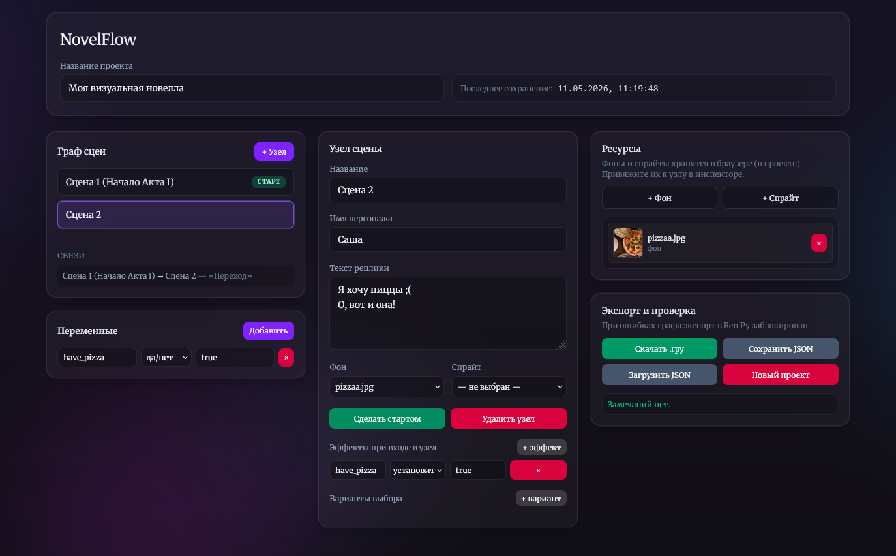

# ✒️ NovelFlow (MVP)

**NovelFlow** — это удобный визуальный редактор для сценаристов и инди-разработчиков, создающих визуальные новеллы.

Писать разветвленные диалоги прямо в коде бывает утомительно, т.к. легко запутаться в переменных, забыть прописать концовку или потерять ветку. **NovelFlow** решит эту проблему, предлагая понятный интерфейс для управления узлами (нодами) истории. Достаточно просто написать сюжет, добавить выборы и экспортировать готовый скрипт в **`.rpy` (Ren'Py)** или **`.json`** в один клик.

 *Скриншот версии 1.1*

---

### Приемущества

- 🗺️ Создание узлов диалогов и связка их через выборы (Node-based архитектура).
- ⚙️ Легкое добавление условий и эффектов для каждого узла (например, повышение отношений с персонажем).
- 🖼️ Удобный менеджер используемых фонов и спрайтов на каждой сцене.
- 🚨 Встроенный чекер логики. Т.е. система сама подскажет, если забыть написать текст диалога или если какой-то узел недостижим из стартовой точки.
- 🚀 Готовый генератор кода для **Ren'Py (.rpy)**. Но если у вас свой движок, то предусмотрен экспорт в **JSON**.

---

### Роадмапа

Поскольку проект находится в стадии MVP, впереди еще много планов:

- [x] Базовый граф и инспектор узлов
- [x] Экспорт в `.rpy` и `.json`
- [x] Втроенная валидация логики
- [ ] Полноценный визуальный Canvas (Drag & Drop)
- [ ] Превью сцен в реальном времени
- [ ] _..._

---

### 🤝 Как поддержать?

Если вам нравится идея проекта, то просто поставьте ⭐ **Star** этому репозиторию :) 
Буду рад пулл-реквестам и новым идеям, как можно улучшить проект.

_Создано писателем для писателей_
